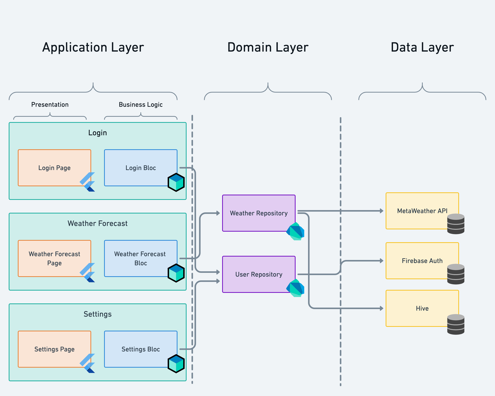

# bloc_example



## 환경설정
```yaml
dependencies:
  flutter_bloc: ^8.0.0
```

`flutter pub get`

## 개발

## 참고자료
- [Bloc Offical](https://bloclibrary.dev/#/)
- [Architecutre](https://bloclibrary.dev/#/architecture?id=data-layer)
- [Naming Convention](https://bloclibrary.dev/#/blocnamingconventions)
