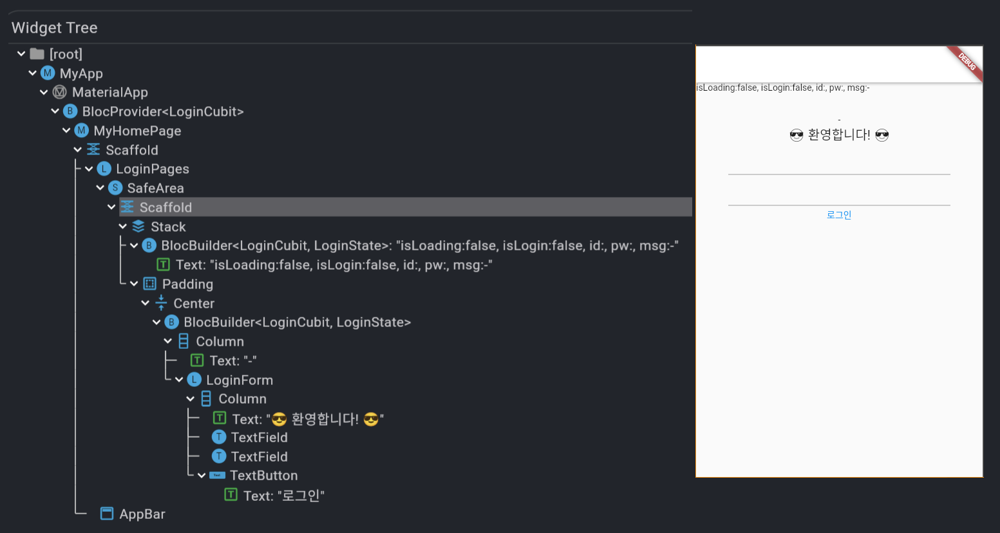
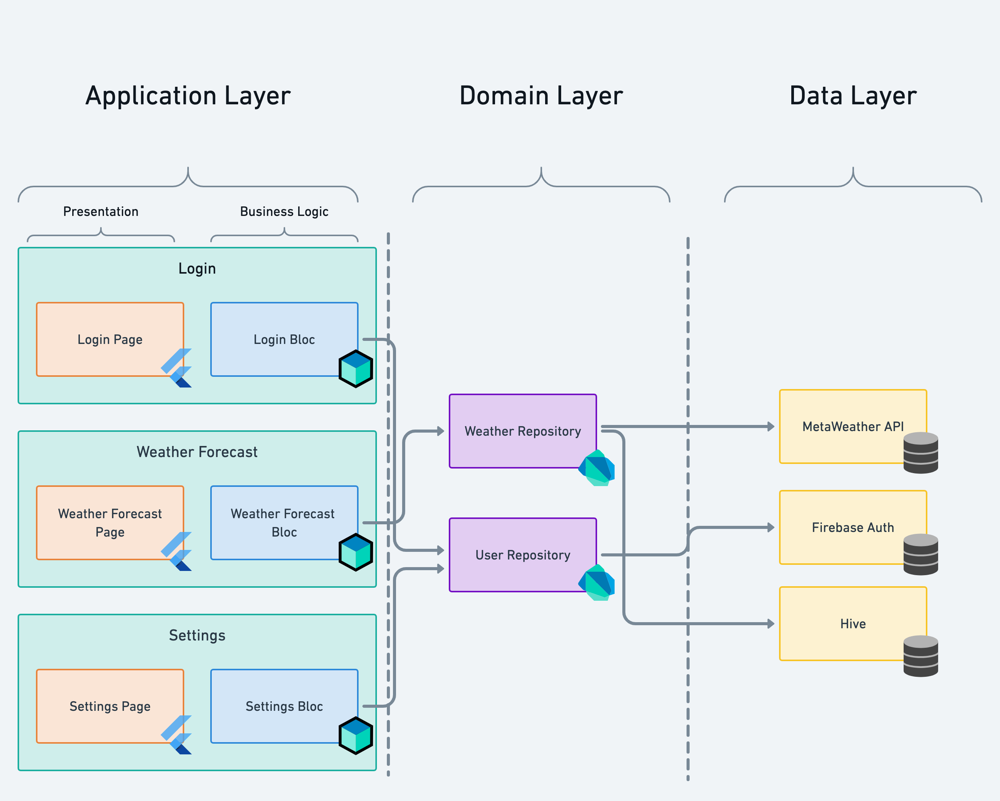

# bloc_example
cubit(viewModel)을 이용한 간단한 login flow 예시

### 프로젝트 실행 예시


### 실행 예시


<br/>

## bloc 구조
### 동작 구조


### Bloc을 사용한 아키텍처



<br/>

## 환경설정
- 의존성 추가 (pubspec.yaml)
```yaml
dependencies:
  flutter_bloc: ^8.0.0
```

- 프로젝트 업데이트 (terminal에서 입력)
`flutter pub get`

<br/>

## 간단히 Cubit을 사용한 예
```dart
// counter_cubit.dart
import 'package:flutter_bloc/flutter_bloc.dart';

class CounterCubit extends Cubit<int> {
  CounterCubit(int initalState) : super(initalState);

  void increment() => emit(state + 1);
}

// main.dart
void main() {
  final cubit = CounterCubit(0);
  print(cubit.state);  // 0
  cubit.increment();
  print(cubit.state);  // 1
  cubit.close();
}
```


<br/>

## 개발

- Cubit 클래스 선언시 <꺽쇠> 안에 기억해 둘 Object를 명시한다.
- emit(state)을 통해 Object 정보가 바뀔 때 업데이트가 된다. Object 정보가 바뀌었음의 간단한 기준은 CubitClass.onChange()가 발생할 때이다.
  - state class가 달라질때 변화를 반영(setState)하게 된다. 달라졌다는 것의 기준은 obejct의 hash인 듯 
- Cubit은 BlocBase를 상속하고 있으며 생성시 _blocObserver.onCreate가 실행된다.
- 관련한 모든 동작에 대해서 bloc_observer.dart를 참고하면 좋다.

- Cubit 선언 예시
```dart
class LoginCubit extends Cubit<LoginState> {
  LoginCubit()
      : super(LoginState(
            isLoading: false, isLogin: false, id: "", pw: "", message: "-"));
            
  ...
  
  // emit
  @override
  void onChange(Change<LoginState> loginState) {
    super.onChange(loginState);
    print(loginState.toString());
  }
```


<br/>

- emit 상태 업데이트 예시
  - 이 코드에서는 method chaining 을 이용하였으나, 보통 copyWith을 많이 사용함
  - method chaining시 주의할 점은 state update 이후 onChange를 호출시키기 위하여 반드시 `새로운 state`를 반환해야 한다는 점
```dart
// 로그인 시도 했을 때
void tryLogin(String id, String pw) async {
// 로그인 정보를 가져오고 Loading 상태로 변경
emit(state.setAccount(id, pw).setLoading(true).copy()); // method chaining

// 대기
await Future.delayed(const Duration(seconds: 3));

// 계정 정보를 확인하고 결과를 적용
if (id == "testid" && pw == "testpw") {
  emit(state.setLogin(true).setMessage("로그인 성공!").setLoading(false).copy());
  return;
}
emit(state.setLogin(false).setMessage("로그인 실패!").setLoading(false).copy());
}
```


<br/>

## 참고자료
- [Bloc Offical](https://bloclibrary.dev/#/)
- [Architecutre](https://bloclibrary.dev/#/architecture?id=data-layer)
- [Naming Convention](https://bloclibrary.dev/#/blocnamingconventions)
- https://pub.dev/documentation/bloc/latest/bloc/Cubit-class.html
