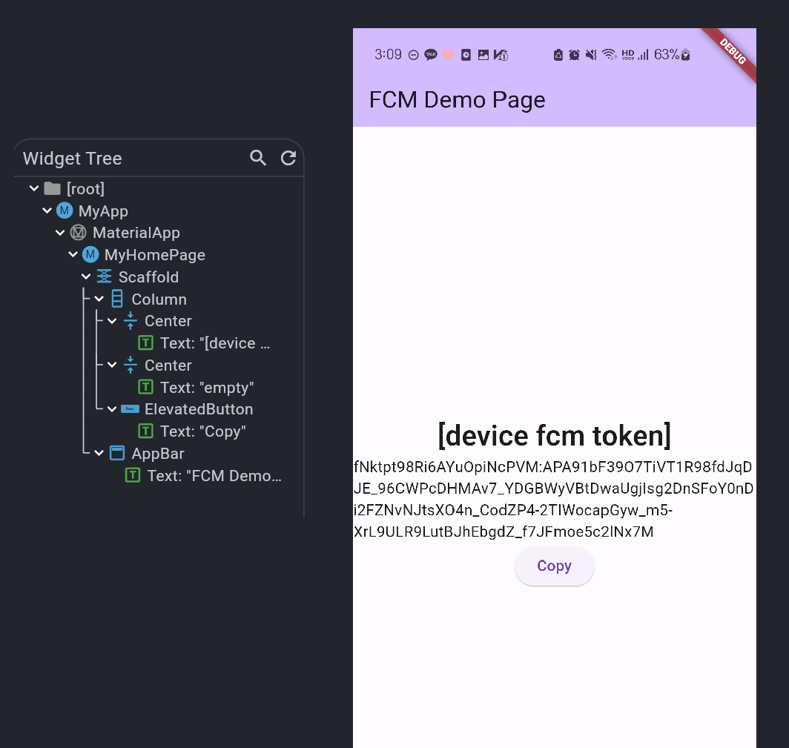
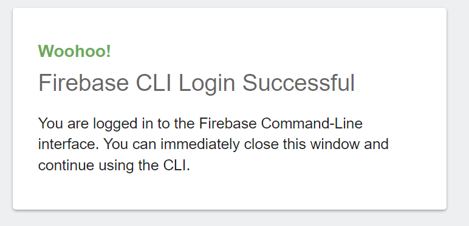
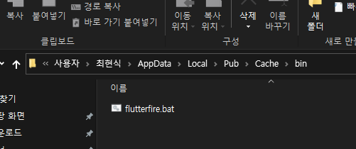
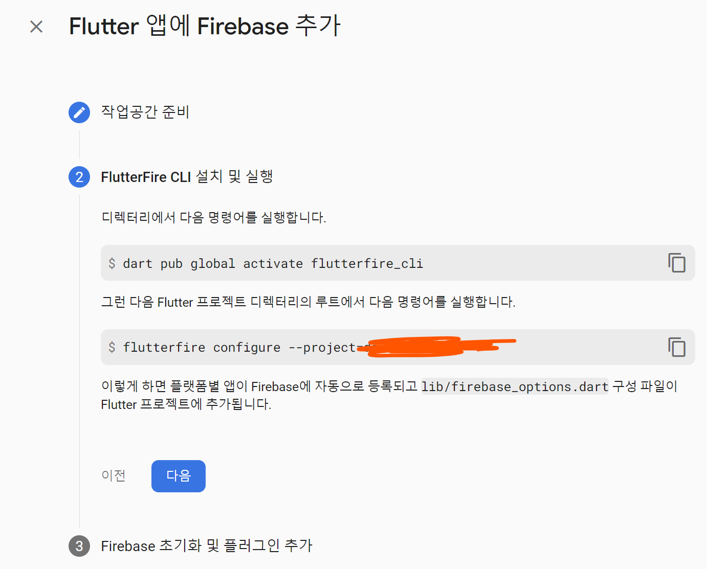
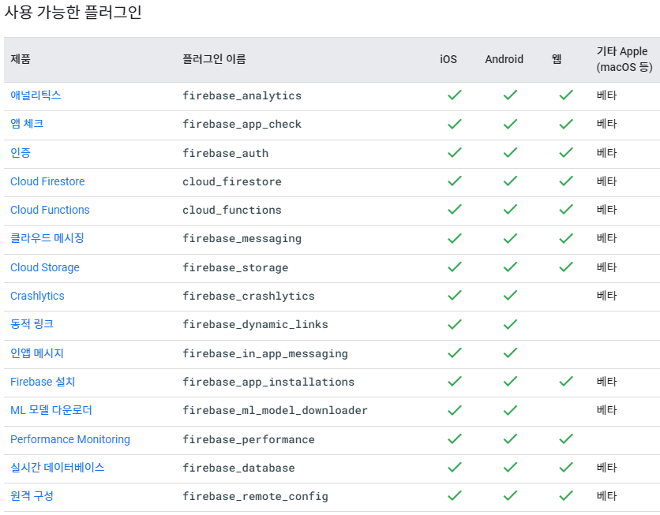
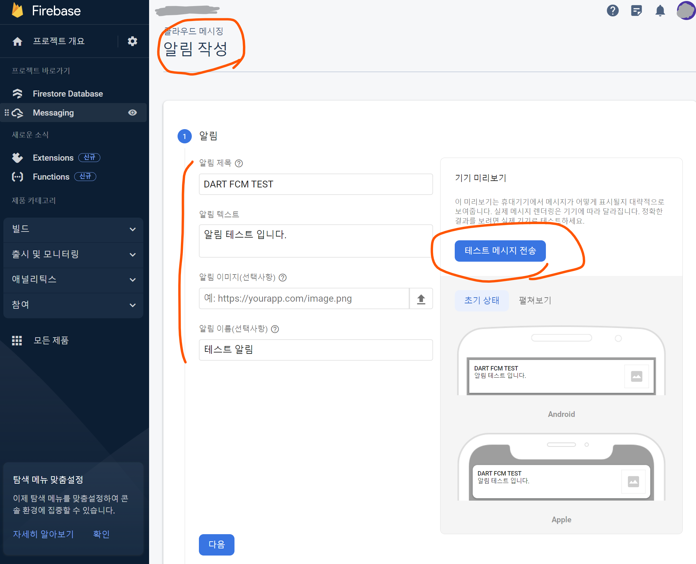
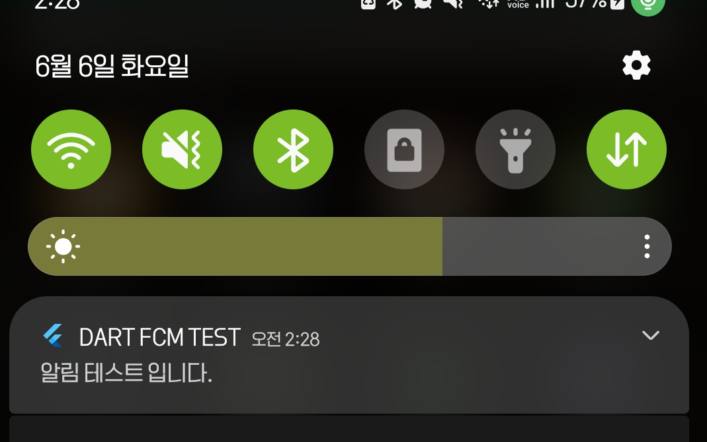
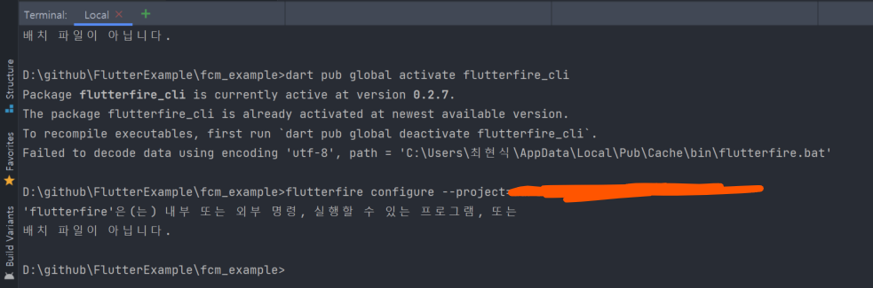

# FCM Example
- 안드로이드를 기준으로 작성
- 요구사항
  - 최소 Android API 19
  - Android 4.4 이상
- 이 프로젝트를 이용해서 테스트 하려는 경우 `lib/firebase_options.dart`에 있는 정보를 firebase 프로젝트에 맞게 수정 할 것

###  앱 실행모습


<br/>
<br/>

## Firebase SDK 설치
### Firebase-tools 설치
npm이 있다면 이를 이용해서 설치
`npm install -g firebase-tools`

설치완료 후 firebase 로그인
`firebase login`



<br/>

FlutterFire CLI 설치
- 윈도우는 환경변수를 직접등록하라는 멘트와 함께 경로 정보가 나오니 집중해서 봐야한다!!
`dart pub global activate flutterfire_cli`
 
- 참고로 환경변수는 아래 위치에 있다. 



<br/>

### Firebase Project 생성




<br/>
<br/>

## 개발 환경설정
### Project 연결
선택한 플랫폼(android, ios, web)별 앱이 Firebase에 자동으로 등록되고 lib/firebase_options.dart 구성 파일이 Flutter 프로젝트에 추가됩니다.
```aidl
flutterfire configure
또는
flutterfire configure --project=nnnn-000000 // 실제 파이어베이스 프로젝트명

✔ Which platforms should your configuration support (use arrow keys & space to select)? · android, web
Firebase configuration file lib\firebase_options.dart generated successfully with the following Firebase apps:
```

<br/>

### Firebase 초기화 및 플러그인 추가
Firebase를 초기화하려면 새 firebase_options.dart 파일의 구성으로 firebase_core 패키지에서 Firebase.initializeApp을 호출합니다.
```dart
import 'package:firebase_core/firebase_core.dart';
import 'firebase_options.dart';

// ...

await Firebase.initializeApp(
options: DefaultFirebaseOptions.currentPlatform,
);
```
그런 다음 사용할 Firebase 제품의 Flutter 플러그인을 추가하고 사용합니다.



참고: 애널리틱스 또는 Performance Monitoring을 사용하는 경우 몇 가지 추가 설정 단계를 수행해야 할 수도 있습니다.

<br/>
<br/>

## FCM
### 의존성 추가
```python
flutter pub add firebase_messaging

Resolving dependencies...
+ _flutterfire_internals 1.3.2
  collection 1.17.1 (1.17.2 available)
+ firebase_messaging 14.6.2
+ firebase_messaging_platform_interface 4.5.2
+ firebase_messaging_web 3.5.2
  matcher 0.12.15 (0.12.16 available)
  material_color_utilities 0.2.0 (0.5.0 available)
  source_span 1.9.1 (1.10.0 available)
  test_api 0.5.1 (0.6.0 available)
Changed 4 dependencies!
```

<br/>

### 등록 토큰 엑세스
아래 코드를 통해 `fcmToken`을 확인할 수 있고, 해당 토큰을 기반으로 device에 알림을 전송할 수 있다.
```dart
final fcmToken = await FirebaseMessaging.instance.getToken();
```

<br/>

### 테스트 알림 메시지 전송



1. 대상 기기에 앱을 설치하고 실행합니다. Apple 기기에서는 원격 알림을 수신할 수 있는 권한 요청을 수락해야 합니다.
2. 앱을 기기에서 백그라운드 상태로 만듭니다.
3. Firebase Console에서 메시지 페이지를 엽니다.
4. 첫 번째 메시지인 경우 첫 번째 캠페인 만들기를 선택합니다. 
   Firebase 알림 메시지를 선택하고 만들기를 선택합니다.
5. 그렇지 않으면 캠페인 탭에서 새 캠페인을 선택한 후 알림을 선택합니다.
6. 메시지 본문을 입력합니다. 다른 모든 필드는 선택사항입니다.
7. 오른쪽 창에서 테스트 메시지 전송을 선택합니다.
8. FCM 등록 토큰 추가 필드에 이 가이드의 앞선 섹션에서 가져온 등록 토큰을 입력합니다.
9. 테스트를 선택합니다.

테스트를 선택하면 타겟팅된 클라이언트 기기(앱은 백그라운드 상태임)에서 알림을 수신해야 합니다.
앱으로 전송된 메시지의 통계를 파악하려면 Apple 및 Android 기기에서 열린 전송 메시지 수와 Android 앱의 '노출수'(사용자에게 표시된 알림) 데이터가 기록된 FCM 보고 대시보드를 확인합니다.

<br/>

### 수신 확인




<br/>
<br/>

## Error 
### flutterfire 없음



https://firebase.flutter.dev/
```python
flutter pub add firebase_core

Resolving dependencies...
  collection 1.17.1 (1.17.2 available)
+ firebase_core 2.13.1
+ firebase_core_platform_interface 4.8.0
+ firebase_core_web 2.5.0
+ flutter_web_plugins 0.0.0 from sdk flutter
  matcher 0.12.15 (0.12.16 available)
  material_color_utilities 0.2.0 (0.5.0 available)
+ plugin_platform_interface 2.1.4
  source_span 1.9.1 (1.10.0 available)
  test_api 0.5.1 (0.6.0 available)
Changed 5 dependencies!

# Install the CLI if not already done so
dart pub global activate flutterfire_cli

# Run the `configure` command, select a Firebase project and platforms
flutterfire configure
```

<br/>

### android: minSdkVersion
- minSdkVersion 19 이상 필요
- `fcm_example/android/app/build.gradle` 파일을 편집
```groovy
android {
    ...
    defaultConfig {
        minSdkVersion 19
        ...
    }
    ...
```
  

에러 전문
```python
D:\github\FlutterExample\fcm_example\android\app\src\debug\AndroidManifest.xml Error:
	uses-sdk:minSdkVersion 16 cannot be smaller than version 19 declared in library [:firebase_messaging] D:\github\FlutterExample\fcm_example\build\firebase_messaging\intermediates\merged_manifest\debug\AndroidManifest.xml as the library might be using APIs not available in 16
	Suggestion: use a compatible library with a minSdk of at most 16,
		or increase this project's minSdk version to at least 19,
		or use tools:overrideLibrary="io.flutter.plugins.firebase.messaging" to force usage (may lead to runtime failures)

FAILURE: Build failed with an exception.

* What went wrong:
Execution failed for task ':app:processDebugMainManifest'.
> Manifest merger failed : uses-sdk:minSdkVersion 16 cannot be smaller than version 19 declared in library [:firebase_messaging] D:\github\FlutterExample\fcm_example\build\firebase_messaging\intermediates\merged_manifest\debug\AndroidManifest.xml as the library might be using APIs not available in 16
  	Suggestion: use a compatible library with a minSdk of at most 16,
  		or increase this project's minSdk version to at least 19,
  		or use tools:overrideLibrary="io.flutter.plugins.firebase.messaging" to force usage (may lead to runtime failures)
```


<br/>
<br/>

## Link
- https://firebase.google.com/docs/flutter/setup?hl=ko&platform=android
- https://doctorson0309.tistory.com/381
- https://firebase.google.com/docs/cloud-messaging/flutter/first-message?hl=ko
