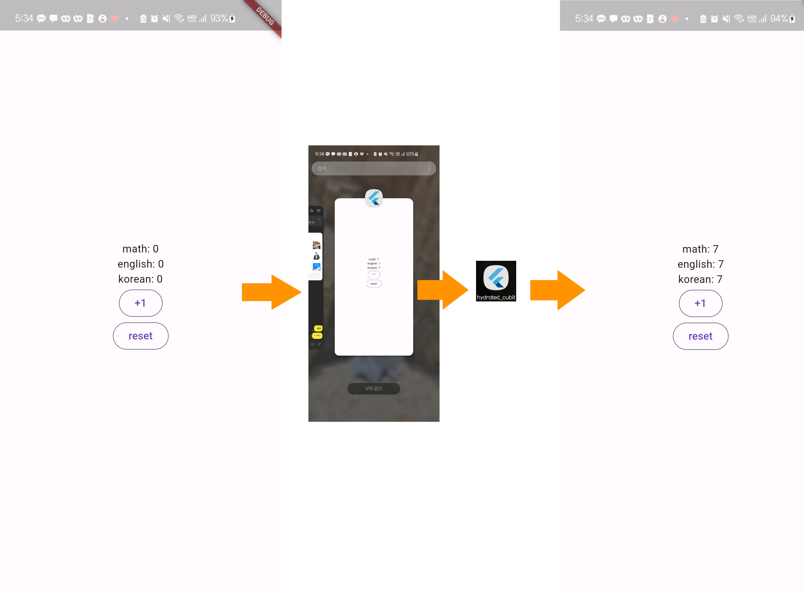

# hydrated_cubit
Cubit(ViewModel과 유사한)의 값이 앱 종료 이후에도 유지된다.

## 환경설정

### 의존성 추가
```dart
dependencies:
  flutter_bloc: ^8.1.3
  hydrated_bloc: ^9.1.2
  path_provider: ^2.0.15
```

## 코드 추가
### main.dart
runApp을 하기 전에 HydratedBloc에 Storage 정보를 추가해줘야한다. 
```dart
Future<void> main() async {
  WidgetsFlutterBinding.ensureInitialized();
  HydratedBloc.storage = await HydratedStorage.build(storageDirectory: ...);
  runApp(App());
}
```

### score_cubit.dart
```dart
import 'package:hydrated_bloc/hydrated_bloc.dart';
import 'package:hydrated_cubit/score_state.dart';

class ScoreCubit extends HydratedCubit<ScoreState> {
  ScoreCubit() : super(ScoreState(korean: 0, english: 0, math: 0));

  void plus() {
    // 점수 더하기 처리
    state.korean = (state.korean ?? 0) + 1;
    state.english = (state.english ?? 0) + 1;
    state.math = (state.math ?? 0) + 1;
    print(state.toString());

    // 변경된 사항을 반영하기 위해 새로운 instance를 생성하여 저장
    emit(ScoreState(
      korean: state.korean,
      english: state.english,
      math: state.math,
    ));
  }

  void reset() {
    emit(ScoreState(
        korean: 0,
        english: 0,
        math: 0)
    );
  }

  @override
  fromJson(Map<String, dynamic> json) {
    print("fromJson: ${json.toString()}");
    return ScoreState.fromJson(json);
  }

  @override
  Map<String, dynamic>? toJson(state) {
    print("toJson: ${state.toString()}");
    return state.toJson();
  }
}
```

### score_state.dart
```dart
class ScoreState {
  int? korean;
  int? english;
  int? math;

  ScoreState({this.korean, this.english, this.math});

  ScoreState.fromJson(Map<String, dynamic> json) {
    korean = json['korean'];
    english = json['english'];
    math = json['math'];
  }

  Map<String, dynamic> toJson() {
    final Map<String, dynamic> data = new Map<String, dynamic>();
    data['korean'] = this.korean;
    data['english'] = this.english;
    data['math'] = this.math;
    return data;
  }

  @override
  String toString() {
    return 'ScoreState{korean: $korean, english: $english, math: $math}';
  }
}
```

## 실행
앱 종료후 다시 실행하여도 데이터가 유저되어있음


## 참고자료
https://pub.dev/packages/hydrated_bloc

