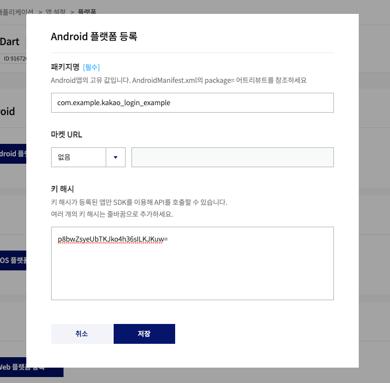
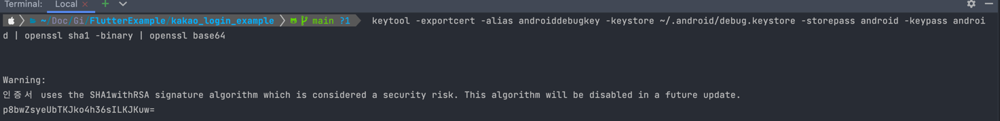

# kakao_login_example
2023-06-02

## add dependencies
```groovy
dependencies:
  kakao_flutter_sdk: ^1.4.1 # 전체 추가
  kakao_flutter_sdk_user: ^1.4.1 # 카카오 로그인
  kakao_flutter_sdk_talk: ^1.4.1 # 카카오톡 메시지, 카카오톡 소셜(프로필 가져오기, 친구 목록 가져오기)
  kakao_flutter_sdk_story: ^1.4.1 # 카카오스토리
  kakao_flutter_sdk_share: ^1.4.1 # 카카오톡 공유
  kakao_flutter_sdk_navi: ^1.4.1 # 카카오내비
  kakao_flutter_sdk_friend: ^1.4.1 # 카카오톡 소셜(피커: 친구 선택하기)
```

`flutter pub get`

## 카카오 개발자 페이지 설정


```xml
<manifest xmlns:android="http://schemas.android.com/apk/res/android"
    package="com.example.kakao_login_example">
    <uses-permission android:name="android.permission.INTERNET" />
    ...

    <intent-filter>
        ...
        <data android:scheme="kakao${YOUR_NATIVE_APP_KEY}" android:host="oauth"/>
        <!--쌍따옴표안에 카카오개발자 페이지에 있는 네이티브앱 키를 입력하세요. ex) "s123d123if5joa8w8eo9j9fwa3e"-->
    </intent-filter>
    ...

```


debug key hash
` keytool -exportcert -alias androiddebugkey -keystore ~/.android/debug.keystore -storepass android -keypass android | openssl sha1 -binary | openssl base64`

release key hash
`keytool -exportcert -alias <RELEASE_KEY_ALIAS> -keystore <RELEASE_KEY_PATH> | openssl sha1 -binary | openssl base64`

## Link
https://velog.io/@morion002/Flutter-2-Kakao-SDK-for-Flutter
https://vanillacreamdonut.tistory.com/200


