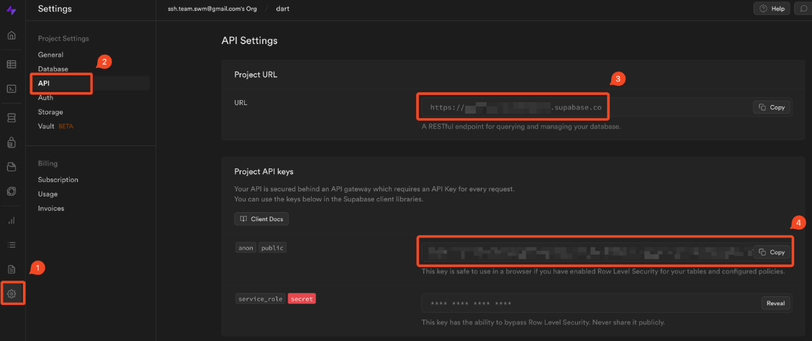
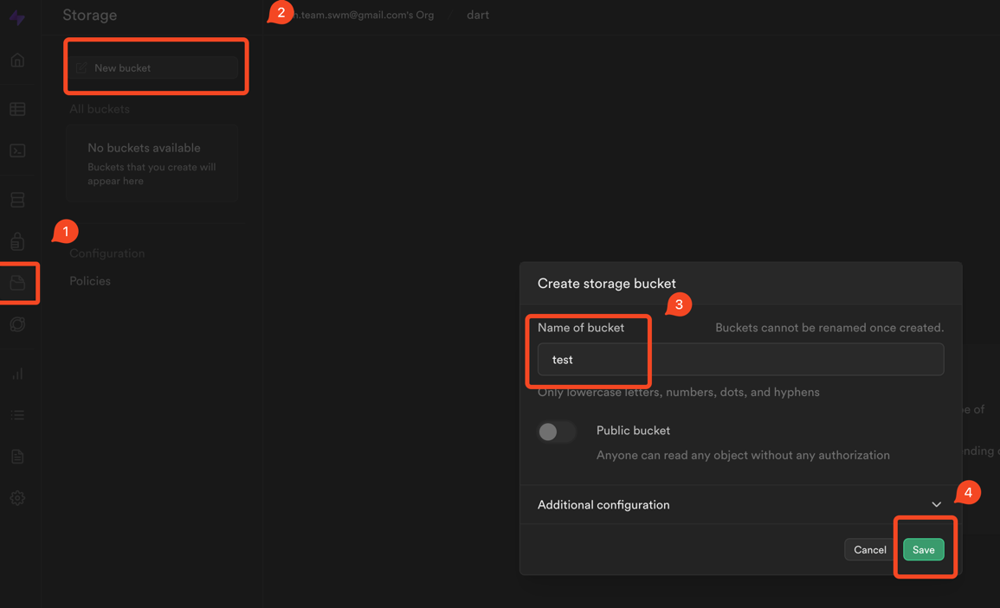
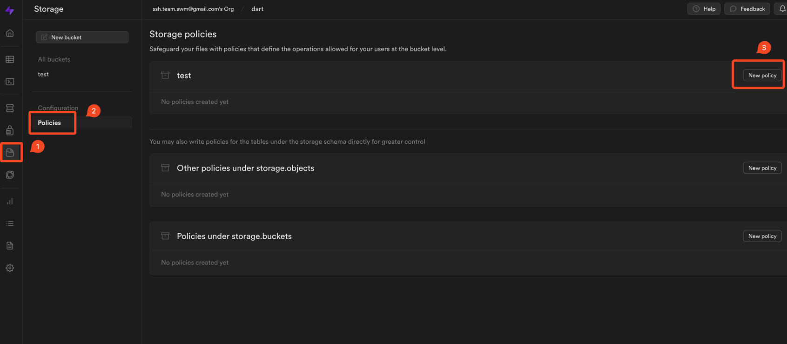
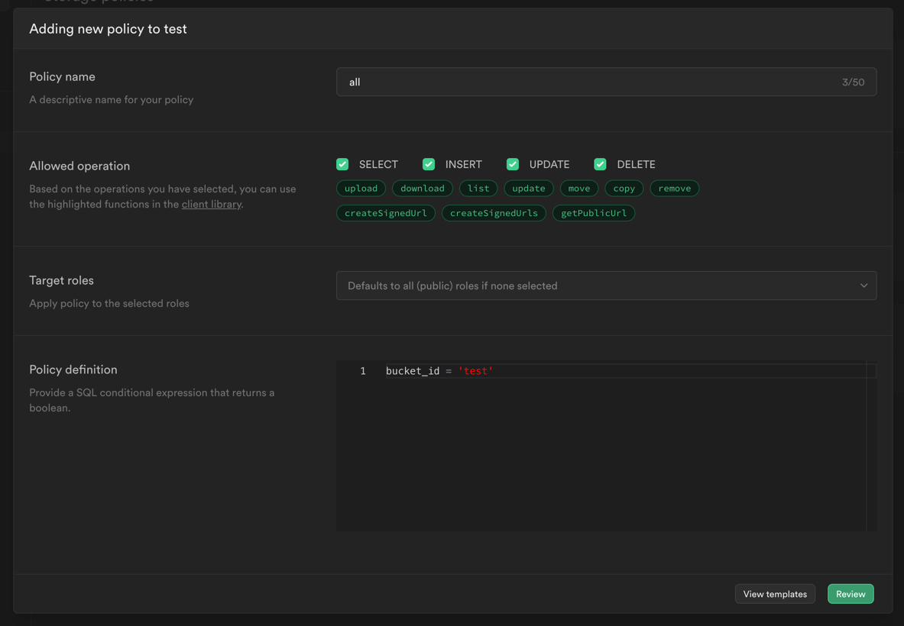
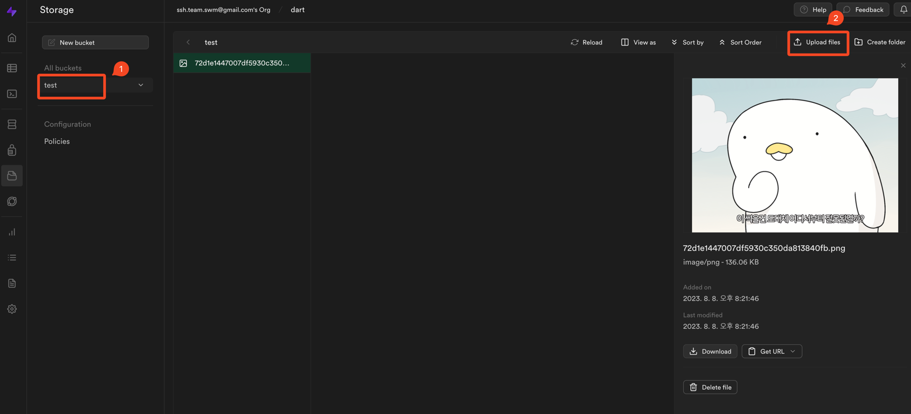

# supabase_image_storage_example
슈퍼베이스의 storage에 저장된 이미지를 불러오는 예제프로젝트 입니다.

<br/>

## 실행환경 설정
### 환경정보 확인
Project URL 및 Project API keys 를 확인한다.


### Flutter 의존성 추가
```python
flutter pub add supabase_flutter
```

### supabase 초기화 코드 추가
슈퍼베이스 객체를 생성하고 초기화하여 커넥션 정보를 만들어둔다.

```dart
void main() async {
  await Supabase.initialize(
      url: "https://your_project_url.supabase.co",
      anonKey: "----------------------your_project_api_key----------------------",
  );

  runApp(const MyApp());
}
```


<br/>

## 연결 테스트
초기화 코드 추가 후 정상적으로 실행됬을 시 콘솔에 아래와 같이 표출된다.
```python
flutter: ***** Supabase init completed Instance of 'Supabase'
flutter: ***** SupabaseDeepLinkingMixin startAuthObserver
```


<br/>

## Storage 설정
### Storage 생성


### 정책 설정





<br/>

## Test
### Download
supabase에 임의의 이미지를 저장해두고 이를 아래와 같은 코드로 불러와서 확인한다.



```dart
// init
supabase = Supabase.instance.client;
files = await supabase.storage.from(bucketName).list();
setState(() {
  files;
});

// get Image Url
for (var file in files)
  StorageChild(
    fileName: file.name,
    fileUrl: supabase.storage.from(bucketName).getPublicUrl(file.name),
  ),
```


<br/>

## etc
- https://stackoverflow.com/questions/74302341/supabase-bucket-new-row-violates-row-level-security-policy-for-table-objects
