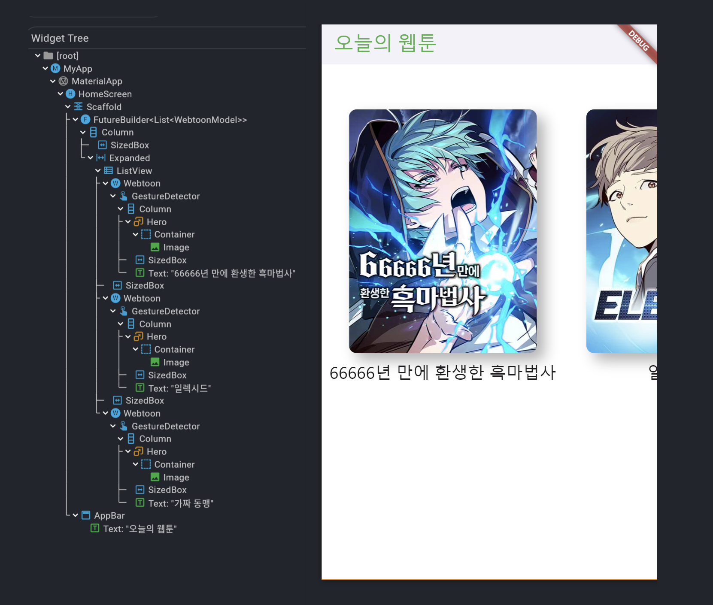

# webtoon_example

### Used
- widget
  - singleChildScrollView
  - hero
  - future builder 
  - listview (with builder)
  - future class
- pub (flutter plugin)
  - SharedPreference
  - http
  - urlLauncher

### Display
- 실행 화면

- 동작 화면

